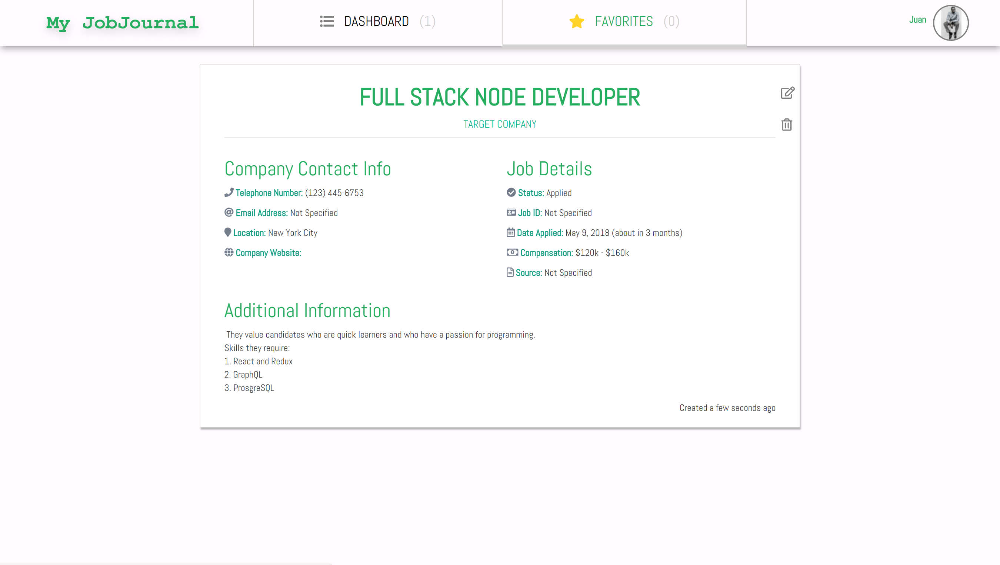
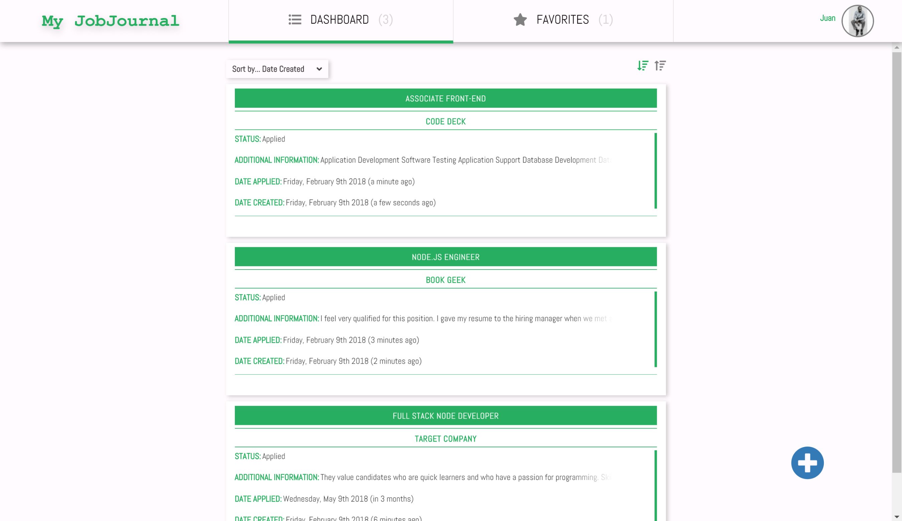
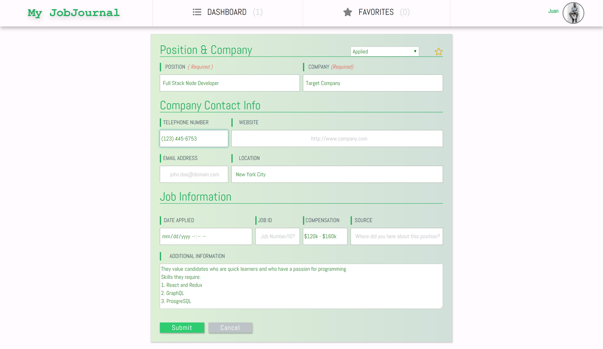
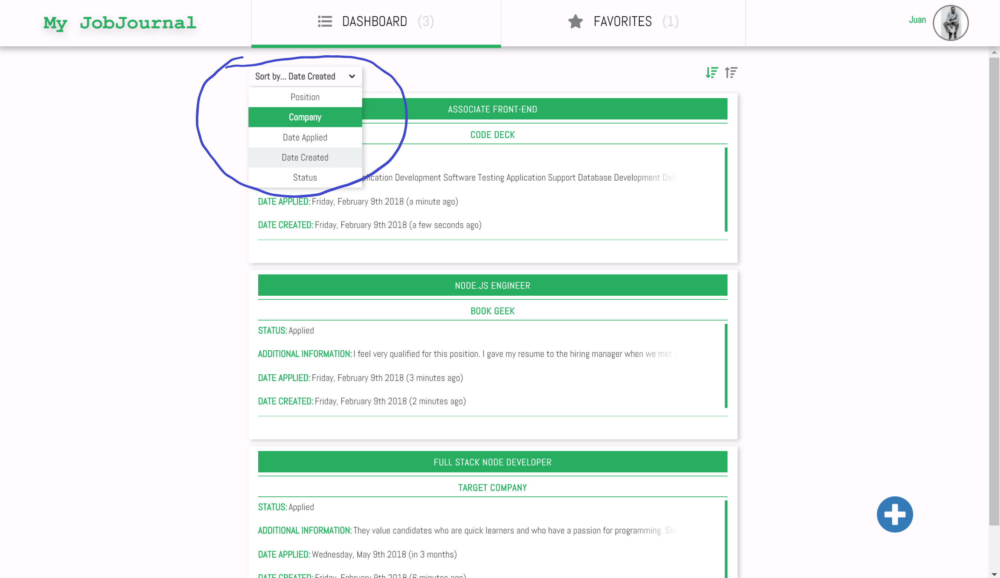

# My JobJournal

## Purpose

'My JobJournal' is for people who are in search of a job and want a convenient place to keep a record of the companies they applied to and the position that they have their eyes on. This is an alternative to using something as inconvenient as a spread sheet or just plain old pen and paper.

## Technologies and/or Packages Used

### Language
* JavaScript(ES6)

### Front-End

* React16
* Redux
* Redux Thunk
* Axios
* FontAwesome 5 (for React)
* #### For Styling
  * Styled-Components
  * CSS3
  * CSS Grid Layout
  * KeyFrames
  * _And Lots More_...

#### Backend

* Node.js
* Passport
* OAuth2.0
* Express.js
* MongoDB (with Mongoose)
* JavaScript (ES6)

#### Development Environment

* ESLint - Airbnb rules
* NPM
* Concurrently

## Features

### Beautiful UI

* View of Single Application

* List of Jobs Already Applied to

* Form

### Authentication with Google

### Client and Server-Side Validation

### Sorting of Data by Different Criterion

